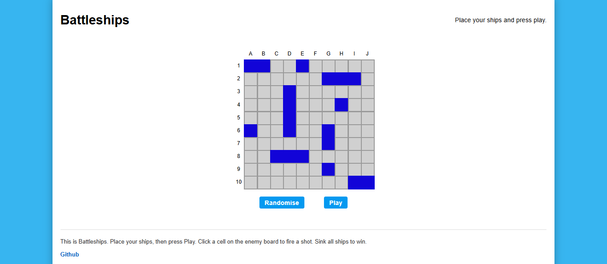
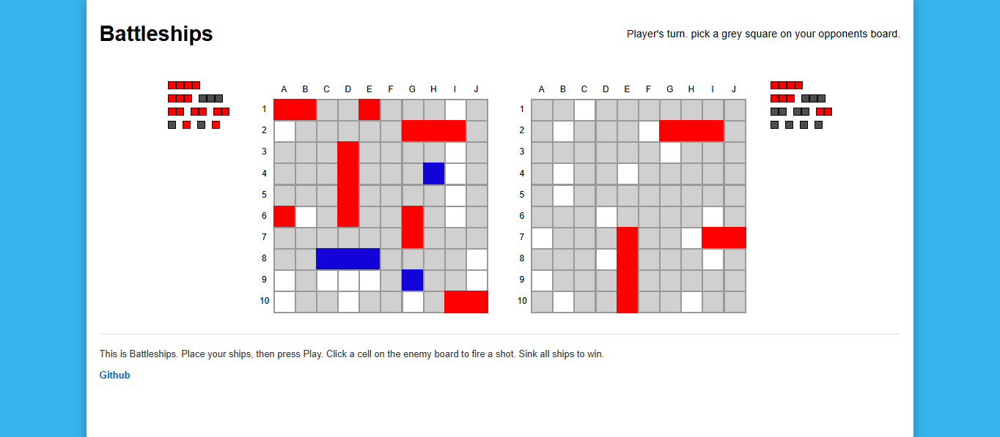
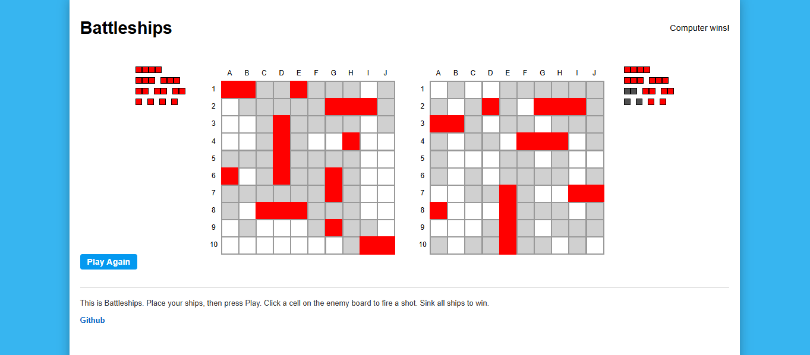
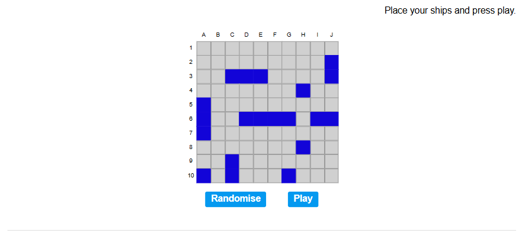
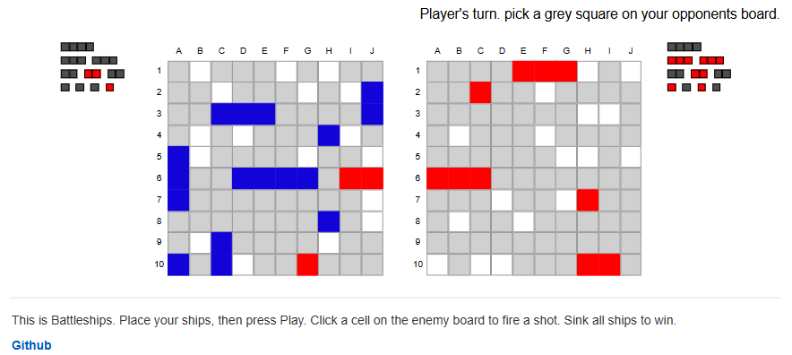
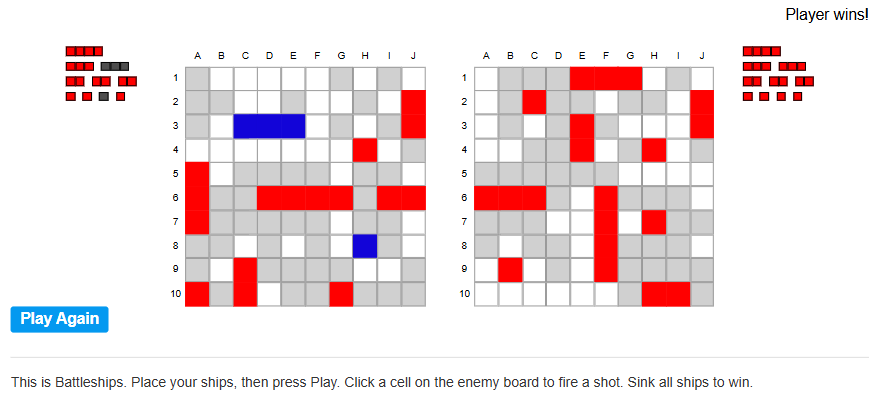
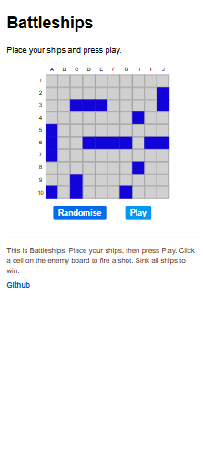
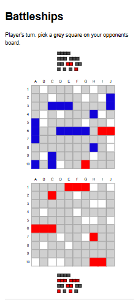
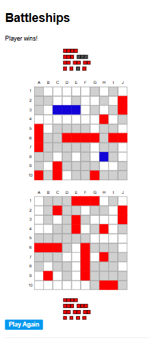

# Battleship
[**Click here**](https://willedgington.github.io/javascript-battleships/) to check out the application deployed on **GitHub Pages**!

An implementation of the classic game 'Battleship' built with **JavaScript**, **HTML**, and **CSS**. The project features a ship-placement phase, a turn-based play phase, and an intelligent computer opponent using a priority-based targeting algorithm.

The UI is designed to be clean, accessible and fully responsive.
It includes coordinate labels, ship status indicators, and adaptive layouts for horizontal and vertical orientations.

## Features

### Core Gameplay
- Interactive **drag-and-drop ship placement** (not-compatible with touch screen)
- Validated placements with adjacency checks
- Clear state feedback: **hit**, **miss**, **sunk**
- Turn-based play vs. computer opponent
- Automatic win detection when all ships are sunk

### AI Opponent
- Finds random valid targets when no information is available
- Prioritises follow-up attacks around successful hits
- Tracks ship orientation after multiple hits
- Clears queues when ships sink
- Mimics human strategy without cheating

### UI & UX
- Fully responsive layout supporting:
  - Standard and condensed horizontal layouts
  - Condensed vertical layout (used on tall/narrow screens)
- Coordinate labels for both axes
- Dynamic ship-status panels showing:
  - Each ship
  - Whether it is afloat or sunk
- Styled interaction cues:
  - Hover highlighting on valid attack cells
  - Correct cursor behaviour for interactable elements

## Technology Stack
- **Vanilla JavaScript** (game logic, AI, DOM interaction)
- **HTML** (layout for different scenes)
- **CSS** (responsive board sizing, styling system)
- **Webpack** (module bundling, asset pipeline)
- **Jest** (unit testing)
- **Github Pages** for deployment

## Contact

Created by [**WillEdgington**](https://github.com/WillEdgington) as a final project for the JavaScript module in the [**Odin Project**](https://www.theodinproject.com/lessons/javascript-battleship) course.

📧 **willedge037@gmail.com**

🔗 [**LinkedIn**](https://www.linkedin.com/in/williamedgington/)

## Screenshots

### Samsung S20 Ultra (horizontal)

### Samsung S20 Ultra (vertical)

